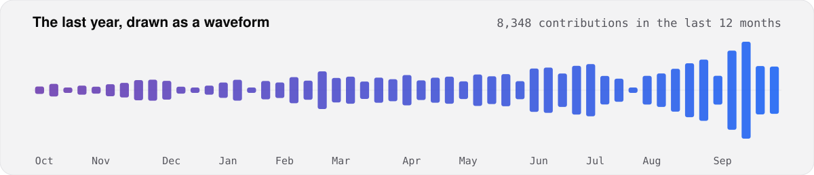

I build voice AI systems that hold up in production. Speech models,
real-time infrastructure, and the orchestration layer in between.

Founder of [Mahimai AI Solutions](https://mahimai.ca) — production voice
AI on the open stack: LiveKit and Pipecat.

**What I work on**
- Fine tuning and evaluating TTS and STT models
- Real-time voice infrastructure: LiveKit, Pipecat, WebRTC, SIP
- Linguistic frontend, turn-taking, and interruption handling
- Concurrency, latency, and cost at production scale

**Contributor to** [livekit-agents](https://github.com/livekit/agents) ·
[FastRTC](https://github.com/gradio-app/fastrtc)

**Author of** [Voice Agents Handbook](https://handbook.mahimai.ca/)

<picture>
  <source media="(prefers-color-scheme: dark)" srcset="assets/waveform-dark.svg">
  
</picture>

<table>
<tr>
<td valign="top" width="50%">

#### Writing
<!-- writing starts -->
[Bilingual Voice Agent: When to Switch Languages](https://mahimai.ca/blog/bilingual-voice-agent-language-switching) Oct 2026

[Build a Real-Time AI Sales Copilot with LiveKit](https://mahimai.ca/blog/ai-sales-copilot-livekit) Oct 2026

[Config-Driven Voice Agents: Swap Prompts and Tools Mid-Call](https://mahimai.ca/blog/config-driven-voice-agents-live-updates) Oct 2026

[Full Duplex vs Cascade Voice Agents: A Blind Test](https://mahimai.ca/blog/full-duplex-vs-cascade-voice-agent) Oct 2026

[Live QA for Voice Agents: Grade Every Call as It Runs](https://mahimai.ca/blog/live-qa-voice-agent-returns) Oct 2026
<!-- writing ends -->

More on [mahimai.ca/blog](https://mahimai.ca/blog)
</td>
<td valign="top" width="50%">

#### Upstream
<!-- upstream starts -->
[Add to onboarding reproduction logs](https://github.com/castorini/anserini/pull/3364) castorini/anserini · Aug 2026

[feat: add livekit-plugins-sambanova with LLM support](https://github.com/livekit/agents/pull/4910) livekit/agents · Feb 2026

[🐛 Fix `--help` text alignment when using `typer.style()` in option descriptions](https://github.com/fastapi/typer/pull/1356) fastapi/typer · Feb 2026

[Feat: FastRTC version of Whisper CPP speech to text to Docs](https://github.com/gradio-app/fastrtc/pull/324) gradio-app/fastrtc · May 2025

[feat: Added documentation for twilio integration](https://github.com/gradio-app/fastrtc/pull/125) gradio-app/fastrtc · Mar 2025
<!-- upstream ends -->

[All <!-- upstream_count starts -->9<!-- upstream_count ends --> merged PRs across <!-- upstream_projects starts -->8<!-- upstream_projects ends --> projects →](contributions.md)
</td>
</tr>
<tr>
<td valign="top" width="50%">

#### Releases
<!-- releases starts -->
[voicegateway 0.27.0](https://pypi.org/project/voicegateway/0.27.0/) Oct 2026

[openrtc 0.20.1](https://pypi.org/project/openrtc/0.20.1/) Sep 2026

[envoic 0.3.1](https://pypi.org/project/envoic/0.3.1/) Jul 2026

[locallens 0.0.2](https://pypi.org/project/locallens/0.0.2/) Apr 2026

[fastrtc-whisper-cpp 0.1.2](https://pypi.org/project/fastrtc-whisper-cpp/0.1.2/) May 2025
<!-- releases ends -->
</td>
<td valign="top" width="50%">

#### Reference lists I maintain
<!-- references starts -->
[Voice AI](https://voiceai.mahimai.ca) · [repo](https://github.com/mahimairaja/voiceai) ★ 333 · updated Sep 2026

[Realtime Voice](https://realtime.mahimai.ca) · [repo](https://github.com/mahimairaja/realtime) ★ 8 · updated Sep 2026

[Awesome TTS](https://tts.mahimai.ca) · [repo](https://github.com/mahimairaja/tts) ★ 19 · updated Sep 2026

[Voice Prices](https://prices.mahimai.ca) · [repo](https://github.com/mahimailabs/voice-prices) ★ 6 · updated Sep 2026

[Voice AI Skills](https://skills.mahimai.ca) · [repo](https://github.com/mahimailabs/voice-ai-skills) ★ 2 · updated Sep 2026
<!-- references ends -->
</td>
</tr>
</table>

### Building

<!-- packages starts -->
| Package | What it does | Latest | Downloads |
|---|---|---|---|
| **voicegateway** | Observability and inference routing for voice AI | [0.27.0](https://pypi.org/project/voicegateway/) Oct 2026 |  |
| **openrtc** | Shared memory layer for multi-agent LiveKit workers | [0.20.1](https://pypi.org/project/openrtc/) Sep 2026 |  |
| **envoic** | Horizontal voice AI infrastructure toolkit | [0.3.1](https://pypi.org/project/envoic/) Jul 2026 |  |
| **fastrtc-whisper-cpp** | whisper.cpp STT backend for FastRTC | [0.1.2](https://pypi.org/project/fastrtc-whisper-cpp/) May 2025 |  |
| **fastrtc-canary** | NVIDIA Canary STT backend for FastRTC | [0.0.2](https://pypi.org/project/fastrtc-canary/) Mar 2025 |  |
| **vapiserve** | Custom tool server for Vapi | [0.0.5](https://pypi.org/project/vapiserve/) Mar 2025 |  |
| **locallens** | Local inference tooling | [0.0.2](https://pypi.org/project/locallens/) Apr 2026 |  |
<!-- packages ends -->

Python, with Go where it matters.

Available for voice AI consulting.
[Book a call](https://cal.com/mahimairaja/consulting)

The lists above rebuild themselves every six hours. <a href="build_readme.py">How this works</a>

